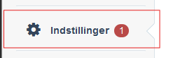
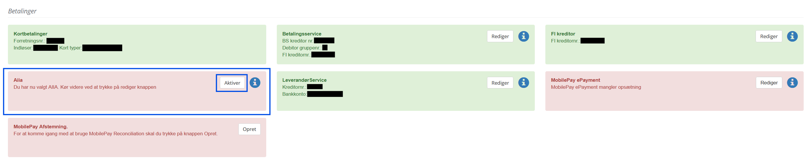

# Aiia Onboarding

### Onboarding Process Overview
Before a company can integrate Aiia as a payment solution for their customers, they must complete the onboarding process.

#### Steps to onboard a Company

1. Access Settings:
    - Navigate to the Settings page    
    
2. Scroll down to the *Payments Section*
    - Activate Aiia by clicking on the button within the Aiia Card
    
3. You'll be redirecting to the *Aiia Connect Flow*
    - Follow the provided instructions presented by Aiia to proceed with the onboarding process.

**Note:** Only select one account during onboarding. Ensure that the selected account aligns with the one associated with your FI Creditor if you intend to use the Aiia Fik Payment Solution.

## Onboard *Aiia FI* as a Payment Solution

After completing the initial onboarding, proceed with the manual onboarding specifically for Aiia FI. This involves filling out a form.

### Required Form
The onboarding form is available in both Danish and English languages:
- [Danish Form - Download](https://github.com/FarPay/PaymentSolutions/raw/main/Aiia/forms/fik_giro_dk.docx)
- [English Form - Download](https://github.com/FarPay/PaymentSolutions/raw/main/Aiia/forms/fik_giro_en.docx)

Certain fields within the form can be filled out by FarPay Support (e.g., Company Name, Address, Number). Hence, the forms are provided in Microsoft Word format (.docx). FarPay Support will complete the applicable fields, save the form as a .pdf, and send it to the company for further completion.

### Submission Process
Once the form is completed and signed by the company, it should be emailed to aiia.kyc@mastercard.com for the KYC process.

### Completion Confirmation
Upon completion of the KYC process, MasterCard will provide a "DestinationId" via email to the company. The company must then provide this DestinationId to FarPay Support. Once this step is done, the Aiia Onboarding process is complete.